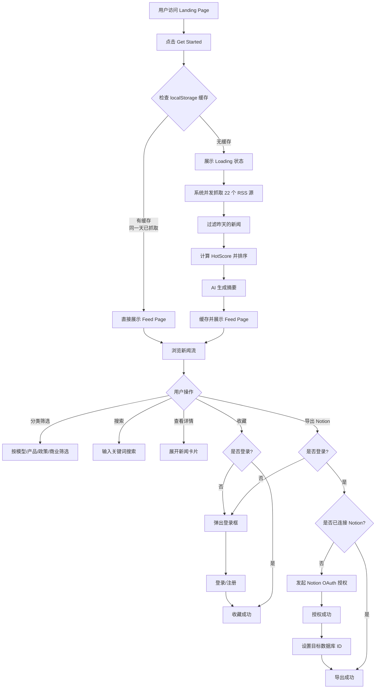
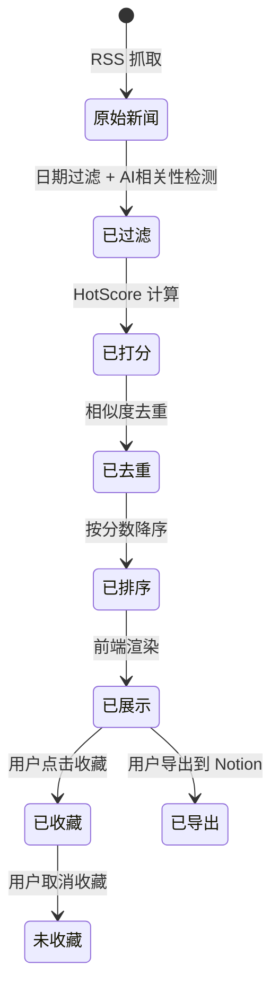
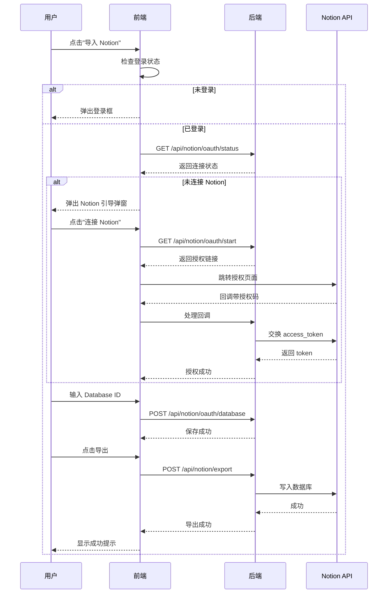

# 产品需求文档：ViviDaily - V1.0

## 1. 综述 (Overview)

### 1.1 项目背景与核心问题

**目标用户**：AI 从业者、研究者、投资者、产品经理、技术观察者、开发者、AI 爱好者

**核心痛点**：
- AI 行业信息分散在多个媒体源，用户需要逐一访问才能获取完整资讯
- 大量低质量、重复、标题党内容干扰真正有价值的信息
- 缺乏统一的热度排序标准，难以快速识别最重要的新闻
- 收藏和整理新闻需要手动复制粘贴，效率低下

**解决方案**：ViviDaily 是一款 AI 热点新闻聚合日报应用，每日自动从 22 个优质信息源抓取昨天的 AI 新闻，通过智能热度算法筛选排序，生成 Top5 榜单和 AI 摘要，支持收藏和一键导出到 Notion。

### 1.2 核心业务流程 / 用户旅程地图

1. **阶段一：访问与触发** - 用户访问 Landing Page，了解产品定位，点击 Get Started 触发新闻抓取
2. **阶段二：新闻抓取与加载** - 系统并发抓取 22 个 RSS 源，过滤昨天的新闻，计算 HotScore，AI 生成摘要
3. **阶段三：新闻浏览与筛选** - 用户查看 Top5 榜单，浏览新闻流，按分类筛选，搜索新闻
4. **阶段四：用户互动与导出** - 用户收藏新闻，分享链接，连接 Notion，导出到个人数据库
5. **阶段五：用户认证与管理** - 用户注册登录，管理收藏夹

### 1.3 Mermaid 图（流程/状态/时序）

#### 1.3.1 用户操作流（必填）



#### 1.3.2 新闻状态机



#### 1.3.3 Notion 导出时序



---

## 2. 用户故事详述 (User Stories)

### 阶段一：访问与触发

---

#### **US-01: 作为 AI 行业关注者，我希望快速了解产品定位并触发新闻抓取，以便高效获取昨天的 AI 热点**

*   **价值陈述 (Value Statement)**:
    *   **作为** AI 行业关注者
    *   **我希望** 在 Landing Page 快速了解产品定位，一键触发新闻抓取
    *   **以便于** 以最少的操作获取昨天的 AI 热点新闻

*   **业务规则与逻辑 (Business Logic)**:
    1.  **前置条件**: 用户访问应用首页
    2.  **操作流程 (Happy Path)**:
        1. 用户看到品牌名 "ViviDaily" 和顶部导航
        2. 用户看到核心文案："AI 热点聚合" 标签、"ViviDaily: 洞察 AI 世界的每日热点窗口" 标题
        3. 用户看到副标题："为你筛选昨天最值得关注的 AI 新闻，聚合热点、模型、商业、产品与政策动态，帮助你更快掌握真正重要的变化。"
        4. 用户点击 "Get Started" 按钮
        5. 系统检查 localStorage 缓存
        6. 若有缓存（同一天已抓取），直接进入 Feed Page
        7. 若无缓存，进入 Loading 状态
    3.  **异常处理 (Error Handling)**:
        * 视频背景加载失败：静默降级，不影响页面功能
        * 缓存读取失败：清除缓存，重新抓取

*   **验收标准 (Acceptance Criteria)**:
    *   **场景1: 首次访问**
        *   **GIVEN** 用户首次访问应用
        *   **WHEN** 页面加载完成
        *   **THEN** 应显示 Landing Page，包含品牌名、核心文案、Get Started 按钮
    *   **场景2: 点击 Get Started（有缓存）**
        *   **GIVEN** 用户同一天已抓取过新闻
        *   **WHEN** 点击 Get Started
        *   **THEN** 直接进入 Feed Page，展示缓存的新闻数据
    *   **场景3: 点击 Get Started（无缓存）**
        *   **GIVEN** 用户当天未抓取过新闻
        *   **WHEN** 点击 Get Started
        *   **THEN** 进入 Loading 状态，开始抓取新闻

---

*   **页面布局线框图 (ASCII Wireframe)**:
    ```
    +-----------------------------------------------------------------------+
    |  ViviDaily                                    [最新热点] [模型解析]   |
    |                                                [商业动态] [政策前沿]   |
    |                                                [Get Started]          |
    +-----------------------------------------------------------------------+
    |                                                                       |
    |                     [视频背景 - 全屏播放]                             |
    |                                                                       |
    |                                                                       |
    |          +--------------------------------------------+               |
    |          |  ● AI 热点聚合                             |               |
    |          +--------------------------------------------+               |
    |                                                                       |
    |          ViviDaily: 洞察 AI 世界的                                    |
    |          每日热点窗口                                                 |
    |                                                                       |
    |          为你筛选昨天最值得关注的 AI 新闻，聚合热点、                  |
    |          模型、商业、产品与政策动态，帮助你更快掌握                    |
    |          真正重要的变化。                                             |
    |                                                                       |
    |          +----------------------+                                    |
    |          |    Get Started       |                                    |
    |          +----------------------+                                    |
    |                                                                       |
    +-----------------------------------------------------------------------+
    ```

---

### 阶段二：新闻抓取与加载

---

#### **US-02: 作为用户，我希望看到清晰的加载状态和进度提示，以便了解系统正在处理我的请求**

*   **价值陈述 (Value Statement)**:
    *   **作为** 用户
    *   **我希望** 在等待新闻抓取时看到清晰的加载状态和进度提示
    *   **以便于** 了解系统正在处理，减少等待焦虑

*   **业务规则与逻辑 (Business Logic)**:
    1.  **前置条件**: 用户点击 Get Started，且无缓存
    2.  **操作流程 (Happy Path)**:
        1. 页面切换到 Loading 状态
        2. 显示加载动画（旋转圆环）
        3. 显示标题："正在抓取昨天的 AI 热点"
        4. 显示副标题："系统正在聚合已启用的信息源，过滤低信号内容，整理摘要、标签与 HotScore，完成后将自动进入新闻流页面。"
        5. 显示步骤列表：
           - 拉取 RSS 信息源
           - 过滤非 AI 与低信号内容
           - 生成摘要、标签与 HotScore
           - 整理热门榜单与 AI 摘要
        6. 抓取完成后自动进入 Feed Page
    3.  **异常处理 (Error Handling)**:
        * 抓取超时（45秒）：显示"抓取超时，请稍后重试"
        * 抓取失败：显示"抓取失败，请稍后重试"，用户可重新点击 Get Started

*   **验收标准 (Acceptance Criteria)**:
    *   **场景1: 正常加载**
        *   **GIVEN** 用户触发新闻抓取
        *   **WHEN** 系统开始抓取
        *   **THEN** 显示 Loading 页面，包含加载动画、标题、副标题、步骤列表
    *   **场景2: 抓取成功**
        *   **GIVEN** 系统正在抓取
        *   **WHEN** 抓取完成
        *   **THEN** 自动进入 Feed Page，展示新闻数据
    *   **场景3: 抓取失败**
        *   **GIVEN** 系统正在抓取
        *   **WHEN** 抓取失败
        *   **THEN** 进入 Feed Page，显示错误提示，新闻列表为空

---

*   **页面布局线框图 (ASCII Wireframe)**:
    ```
    +-----------------------------------------------------------------------+
    |                                                                       |
    |                     ● ViviDaily Daily Fetch                          |
    |                                                                       |
    |                          [旋转加载动画]                               |
    |                                                                       |
    |              正在抓取昨天的 AI 热点                                   |
    |                                                                       |
    |     系统正在聚合已启用的信息源，过滤低信号内容，                      |
    |     整理摘要、标签与 HotScore，完成后将自动进入新闻流页面。           |
    |                                                                       |
    |     +----------------------------------------------------------+      |
    |     |  ● 拉取 RSS 信息源                                       |      |
    |     +----------------------------------------------------------+      |
    |     |  ● 过滤非 AI 与低信号内容                                |      |
    |     +----------------------------------------------------------+      |
    |     |  ● 生成摘要、标签与 HotScore                             |      |
    |     +----------------------------------------------------------+      |
    |     |  ● 整理热门榜单与 AI 摘要                                |      |
    |     +----------------------------------------------------------+      |
    |                                                                       |
    +-----------------------------------------------------------------------+
    ```

---

### 阶段三：新闻浏览与筛选

---

#### **US-03: 作为用户，我希望浏览按热度排序的新闻流，以便快速了解昨天最重要的 AI 动态**

*   **价值陈述 (Value Statement)**:
    *   **作为** 用户
    *   **我希望** 浏览按热度排序的新闻流
    *   **以便于** 快速了解昨天最重要的 AI 动态

*   **业务规则与逻辑 (Business Logic)**:
    1.  **前置条件**: 新闻抓取完成，进入 Feed Page
    2.  **操作流程 (Happy Path)**:
        1. 页面显示三栏布局：左侧分类栏、中间新闻流、右侧 Top5 和 AI 摘要
        2. 新闻流按 HotScore 降序排列
        3. 每条新闻卡片显示：标题、来源、分类、主题标签、热度分数、摘要、发布时间
        4. 用户可滚动浏览所有新闻
    3.  **异常处理 (Error Handling)**:
        * 无新闻：显示"昨天没有符合规则的 AI 新闻"
        * 抓取失败：显示错误提示信息

*   **验收标准 (Acceptance Criteria)**:
    *   **场景1: 正常展示**
        *   **GIVEN** 抓取成功且有新闻
        *   **WHEN** 进入 Feed Page
        *   **THEN** 显示新闻流，按 HotScore 降序排列，每条新闻显示完整信息
    *   **场景2: 无新闻**
        *   **GIVEN** 抓取成功但无符合规则的新闻
        *   **WHEN** 进入 Feed Page
        *   **THEN** 显示"未找到相关内容"提示

---

*   **页面布局线框图 (ASCII Wireframe)**:
    ```
    +--------+-------------------------------------------+------------------+
    | TopNav | ViviDaily              [搜索框]          |                  |
    +--------+-------------------------------------------+------------------+
    | 分类   |                                           | 热门榜单 Top 5   |
    |        |  昨日 AI 简报                             |                  |
    | ● Hot  |  显示昨天全部热点新闻，共 N 条            | 01 新闻标题...   |
    | ○ 商业 |                                           | 02 新闻标题...   |
    | ○ 模型 |  +---------------------------------------+  | 03 新闻标题...   |
    | ○ 产品 |  | 新闻标题                               |  | 04 新闻标题...   |
    | ○ 政策 |  | [来源] [分类] [标签] Hot 99           |  | 05 新闻标题...   |
    |        |  | 摘要内容...                            |  |                  |
    |--------|  | [阅读原文] [分享] [导入Notion] [收藏] |  | +--------------+ |
    | 收藏夹 |  +---------------------------------------+  | | AI 每日摘要  | |
    |   (2)  |                                           | |              | |
    |        |  +---------------------------------------+  | | ● 摘要1      | |
    |--------|  | 新闻标题                               |  | ● 摘要2      | |
    | 登录   |  | [来源] [分类] [标签] Hot 88           |  | ● 摘要3      | |
    |        |  | 摘要内容...                            |  |              | |
    |        |  | [阅读原文] [分享] [导入Notion] [收藏] |  | #Agent #多模态| |
    |        |  +---------------------------------------+  | +--------------+ |
    +--------+-------------------------------------------+------------------+
    ```

---

#### **US-04: 作为用户，我希望按分类筛选新闻，以便聚焦特定领域的动态**

*   **价值陈述 (Value Statement)**:
    *   **作为** 用户
    *   **我希望** 按分类筛选新闻
    *   **以便于** 聚焦特定领域（模型/产品/政策/商业）的动态

*   **业务规则与逻辑 (Business Logic)**:
    1.  **前置条件**: 进入 Feed Page
    2.  **操作流程 (Happy Path)**:
        1. 用户在左侧分类栏看到分类列表：Hot、商业、模型、产品、政策
        2. 用户点击某个分类
        3. 新闻流更新为该分类下的新闻
        4. 页面标题更新为"XX动态"
        5. 显示当前分类的新闻数量
    3.  **异常处理 (Error Handling)**:
        * 该分类无新闻：显示"当前分类暂无内容"

*   **验收标准 (Acceptance Criteria)**:
    *   **场景1: 筛选模型分类**
        *   **GIVEN** 用户在 Feed Page
        *   **WHEN** 点击"模型"分类
        *   **THEN** 新闻流只显示分类为"模型"的新闻，标题显示"模型动态"
    *   **场景2: 切换回 Hot**
        *   **GIVEN** 用户在某个分类下
        *   **WHEN** 点击"Hot"
        *   **THEN** 显示所有新闻，标题显示"昨日 AI 简报"

---

#### **US-05: 作为用户，我希望搜索新闻，以便快速找到特定内容**

*   **价值陈述 (Value Statement)**:
    *   **作为** 用户
    *   **我希望** 通过关键词搜索新闻
    *   **以便于** 快速找到特定内容

*   **业务规则与逻辑 (Business Logic)**:
    1.  **前置条件**: 进入 Feed Page
    2.  **操作流程 (Happy Path)**:
        1. 用户在顶部导航栏看到搜索框
        2. 用户输入关键词
        3. 系统实时过滤新闻，匹配标题、摘要、来源、分类、主题标签
        4. 显示搜索结果数量
    3.  **异常处理 (Error Handling)**:
        * 无匹配结果：显示"未找到相关内容"，提示搜索词

*   **验收标准 (Acceptance Criteria)**:
    *   **场景1: 搜索有结果**
        *   **GIVEN** 用户在 Feed Page
        *   **WHEN** 输入"OpenAI"
        *   **THEN** 显示包含"OpenAI"的新闻，显示搜索结果数量
    *   **场景2: 搜索无结果**
        *   **GIVEN** 用户在 Feed Page
        *   **WHEN** 输入"xyz123"
        *   **THEN** 显示"未找到相关内容"

---

#### **US-06: 作为用户，我希望查看 Top5 热门榜单，以便快速了解最热门的新闻**

*   **价值陈述 (Value Statement)**:
    *   **作为** 用户
    *   **我希望** 查看 Top5 热门榜单
    *   **以便于** 快速了解最热门的新闻

*   **业务规则与逻辑 (Business Logic)**:
    1.  **前置条件**: 进入 Feed Page
    2.  **操作流程 (Happy Path)**:
        1. 用户在右侧边栏看到"热门榜单 Top 5"
        2. 显示前 5 条新闻的排名、标题、分类、热度分数
        3. 用户点击某条新闻，新闻流滚动到对应位置并高亮
    3.  **异常处理 (Error Handling)**:
        * 新闻少于 5 条：显示实际数量

*   **验收标准 (Acceptance Criteria)**:
    *   **场景1: 查看榜单**
        *   **GIVEN** 用户在 Feed Page
        *   **WHEN** 查看右侧边栏
        *   **THEN** 显示 Top5 榜单，按 HotScore 降序
    *   **场景2: 点击榜单项**
        *   **GIVEN** 用户在 Feed Page
        *   **WHEN** 点击榜单中的某条新闻
        *   **THEN** 新闻流滚动到对应位置，该新闻高亮显示

---

#### **US-07: 作为用户，我希望查看 AI 每日摘要，以便快速了解昨天的主要动态**

*   **价值陈述 (Value Statement)**:
    *   **作为** 用户
    *   **我希望** 查看 AI 生成的每日摘要
    *   **以便于** 快速了解昨天的主要动态

*   **业务规则与逻辑 (Business Logic)**:
    1.  **前置条件**: 进入 Feed Page
    2.  **操作流程 (Happy Path)**:
        1. 用户在右侧边栏看到"AI 每日摘要"
        2. 显示 3 条摘要要点
        3. 显示热门主题标签
    3.  **异常处理 (Error Handling)**:
        * 无摘要：显示占位文本

*   **验收标准 (Acceptance Criteria)**:
    *   **场景1: 查看摘要**
        *   **GIVEN** 用户在 Feed Page
        *   **WHEN** 查看右侧边栏
        *   **THEN** 显示 AI 摘要，包含新闻数量、热点主题、来源分布等信息

---

### 阶段四：用户互动与导出

---

#### **US-08: 作为用户，我希望收藏感兴趣的新闻，以便稍后查看**

*   **价值陈述 (Value Statement)**:
    *   **作为** 用户
    *   **我希望** 收藏感兴趣的新闻
    *   **以便于** 稍后在收藏夹中查看

*   **业务规则与逻辑 (Business Logic)**:
    1.  **前置条件**: 进入 Feed Page
    2.  **操作流程 (Happy Path)**:
        1. 用户点击新闻卡片上的"收藏"按钮
        2. 若未登录，弹出登录框
        3. 若已登录，新闻加入收藏，按钮变为"已收藏"
        4. 显示"已加入收藏"提示
    3.  **异常处理 (Error Handling)**:
        * 未登录：弹出登录框，登录后继续操作

*   **验收标准 (Acceptance Criteria)**:
    *   **场景1: 收藏成功（已登录）**
        *   **GIVEN** 用户已登录
        *   **WHEN** 点击"收藏"
        *   **THEN** 新闻加入收藏，显示"已加入收藏"提示
    *   **场景2: 收藏失败（未登录）**
        *   **GIVEN** 用户未登录
        *   **WHEN** 点击"收藏"
        *   **THEN** 弹出登录框

---

#### **US-09: 作为用户，我希望分享新闻链接，以便与他人交流**

*   **价值陈述 (Value Statement)**:
    *   **作为** 用户
    *   **我希望** 分享新闻链接
    *   **以便于** 与他人交流

*   **业务规则与逻辑 (Business Logic)**:
    1.  **前置条件**: 进入 Feed Page
    2.  **操作流程 (Happy Path)**:
        1. 用户点击新闻卡片上的"分享"按钮
        2. 系统将原文链接复制到剪贴板
        3. 显示"已复制分享链接"提示
    3.  **异常处理 (Error Handling)**:
        * 复制失败：显示"复制失败，请稍后重试"

*   **验收标准 (Acceptance Criteria)**:
    *   **场景1: 分享成功**
        *   **GIVEN** 用户在 Feed Page
        *   **WHEN** 点击"分享"
        *   **THEN** 原文链接复制到剪贴板，显示"已复制分享链接"

---

#### **US-10: 作为用户，我希望将新闻导出到 Notion，以便在个人知识库中整理**

*   **价值陈述 (Value Statement)**:
    *   **作为** 用户
    *   **我希望** 将新闻导出到 Notion 数据库
    *   **以便于** 在个人知识库中整理

*   **业务规则与逻辑 (Business Logic)**:
    1.  **前置条件**: 进入 Feed Page，已登录
    2.  **操作流程 (Happy Path)**:
        1. 用户点击新闻卡片上的"导入 Notion"按钮
        2. 若未连接 Notion，弹出 Notion 引导弹窗
        3. 用户点击"连接 Notion"，跳转授权页面
        4. 用户在 Notion 授权后返回应用
        5. 用户输入 Notion Database ID
        6. 系统验证并保存
        7. 用户再次点击"导入 Notion"
        8. 系统将新闻写入 Notion 数据库
        9. 显示"已导入 Notion"，按钮变为"已导入 Notion"
    3.  **异常处理 (Error Handling)**:
        * 未登录：弹出登录框
        * 未连接 Notion：弹出引导弹窗
        * Database ID 无效：显示"Database ID 无效"
        * 字段不匹配：显示具体缺失字段
        * 重复导入：显示"已导入（重复跳过）"

*   **验收标准 (Acceptance Criteria)**:
    *   **场景1: 导出成功**
        *   **GIVEN** 用户已登录且已连接 Notion
        *   **WHEN** 点击"导入 Notion"
        *   **THEN** 新闻写入 Notion 数据库，显示"已导入 Notion"
    *   **场景2: 首次导出（未连接）**
        *   **GIVEN** 用户已登录但未连接 Notion
        *   **WHEN** 点击"导入 Notion"
        *   **THEN** 弹出 Notion 引导弹窗
    *   **场景3: 重复导出**
        *   **GIVEN** 新闻已导出
        *   **WHEN** 再次点击"导入 Notion"
        *   **THEN** 按钮显示"已导入 Notion"，不可点击

---

*   **页面布局线框图 - Notion 引导弹窗 (ASCII Wireframe)**:
    ```
    +---------------------------------------------------------------+
    |  首次导入教程（小白版）                                    [X] |
    +---------------------------------------------------------------+
    |                                                               |
    |  不需要会代码，按下面 3 步做完即可导入到你自己的 Notion。     |
    |  只用配置一次，后续可直接一键导入。                           |
    |                                                               |
    |  +---------------------------------------------------------+  |
    |  | 第 1 步：点击"连接 Notion"并授权                        |  |
    |  |                                                         |  |
    |  | 会跳转到 Notion 官方授权页。选择你要导入的工作区，      |  |
    |  | 然后点"允许"即可。                                      |  |
    |  |                                                         |  |
    |  | [连接 Notion]                                           |  |
    |  +---------------------------------------------------------+  |
    |                                                               |
    |  +---------------------------------------------------------+  |
    |  | 第 2 步：填写 Notion Database ID                        |  |
    |  |                                                         |  |
    |  | 打开你的 Notion 数据库页面，复制 URL 中最后一串长 ID。  |  |
    |  | 也可以直接粘贴完整数据库 URL，系统会自动识别。          |  |
    |  |                                                         |  |
    |  | [请输入 Notion Database ID          ]                   |  |
    |  |                                                         |  |
    |  | 请先在数据库里建好这些字段：                            |  |
    |  | Title(标题)、URL(URL)、Source(单选)...                  |  |
    |  |                                                         |  |
    |  | [保存并继续]                                            |  |
    |  +---------------------------------------------------------+  |
    |                                                               |
    |  +---------------------------------------------------------+  |
    |  | 第 3 步：常见问题排查                                   |  |
    |  | 1) 如果看到"客户端 ID 缺失"...                          |  |
    |  | 2) 如果提示"字段不匹配"...                              |  |
    |  | 3) 如果提示"未连接 Notion"...                           |  |
    |  +---------------------------------------------------------+  |
    |                                                               |
    |                                              [稍后再说]       |
    +---------------------------------------------------------------+
    ```

---

#### **US-11: 作为用户，我希望查看收藏夹，以便管理收藏的新闻**

*   **价值陈述 (Value Statement)**:
    *   **作为** 用户
    *   **我希望** 查看收藏夹
    *   **以便于** 管理收藏的新闻

*   **业务规则与逻辑 (Business Logic)**:
    1.  **前置条件**: 进入 Feed Page
    2.  **操作流程 (Happy Path)**:
        1. 用户点击左侧边栏的"收藏夹"
        2. 页面切换到收藏夹视图
        3. 显示已收藏的新闻（三列卡片布局）
        4. 用户可取消收藏、分享、导出到 Notion
    3.  **异常处理 (Error Handling)**:
        * 无收藏：显示"暂无收藏内容"和引导提示

*   **验收标准 (Acceptance Criteria)**:
    *   **场景1: 查看收藏夹**
        *   **GIVEN** 用户有收藏的新闻
        *   **WHEN** 点击"收藏夹"
        *   **THEN** 显示收藏夹视图，三列卡片展示收藏的新闻
    *   **场景2: 取消收藏**
        *   **GIVEN** 用户在收藏夹视图
        *   **WHEN** 点击"取消收藏"
        *   **THEN** 新闻从收藏夹移除

---

*   **页面布局线框图 - 收藏夹视图 (ASCII Wireframe)**:
    ```
    +--------+----------------------------------------------------------------+
    | TopNav | ViviDaily                              [搜索框]              |
    +--------+----------------------------------------------------------------+
    | 分类   |                                                                |
    |        |  FAVORITES                                                     |
    | ● Hot  |  收藏内容                                                      |
    | ○ 商业 |  当前已收藏 N 条新闻                                           |
    | ○ 模型 |                                                                |
    | ○ 产品 |  +----------------+  +----------------+  +----------------+     |
    | ○ 政策 |  | 新闻标题       |  | 新闻标题       |  | 新闻标题       |     |
    |        |  | [来源] [分类]  |  | [来源] [分类]  |  | [来源] [分类]  |     |
    |--------|  | Hot 99         |  | Hot 88         |  | Hot 77         |     |
    | 收藏夹 |  | 摘要内容...    |  | 摘要内容...    |  | 摘要内容...    |     |
    |   (2)  |  |                |  |                |  |                |     |
    |        |  | [阅读原文] [分享]            | [阅读原文] [分享]            | |
    |--------|  | [导入Notion] [取消收藏]      | [导入Notion] [取消收藏]      | |
    | 用户   |  +----------------+  +----------------+  +----------------+     |
    |  张三  |                                                                |
    |        |  +----------------+  +----------------+                       |
    | [退出] |  | 新闻标题       |  | 新闻标题       |                       |
    |        |  | ...            |  | ...            |                       |
    |        |  +----------------+  +----------------+                       |
    +--------+----------------------------------------------------------------+
    ```

---

### 阶段五：用户认证与管理

---

#### **US-12: 作为新用户，我希望注册账号，以便使用收藏和导出功能**

*   **价值陈述 (Value Statement)**:
    *   **作为** 新用户
    *   **我希望** 注册账号
    *   **以便于** 使用收藏和导出功能

*   **业务规则与逻辑 (Business Logic)**:
    1.  **前置条件**: 用户未登录
    2.  **操作流程 (Happy Path)**:
        1. 用户点击"登录"按钮或触发需要登录的操作
        2. 弹出登录/注册弹窗
        3. 用户点击"切换到注册"
        4. 用户输入邮箱和密码（至少 6 位）
        5. 用户点击"创建账户"
        6. 系统发送验证邮件
        7. 用户验证邮箱后可登录
    3.  **异常处理 (Error Handling)**:
        * 邮箱已存在：显示"邮箱已被注册"
        * 密码太短：显示"密码至少需要 6 个字符"
        * 邮箱格式错误：显示"请输入有效的邮箱地址"

*   **验收标准 (Acceptance Criteria)**:
    *   **场景1: 注册成功**
        *   **GIVEN** 用户在注册弹窗
        *   **WHEN** 输入有效邮箱和密码，点击"创建账户"
        *   **THEN** 显示"注册成功，请查收验证邮件后登录"
    *   **场景2: 邮箱已存在**
        *   **GIVEN** 用户在注册弹窗
        *   **WHEN** 输入已注册的邮箱
        *   **THEN** 显示"邮箱已被注册"

---

#### **US-13: 作为已注册用户，我希望登录账号，以便使用完整功能**

*   **价值陈述 (Value Statement)**:
    *   **作为** 已注册用户
    *   **我希望** 登录账号
    *   **以便于** 使用完整功能

*   **业务规则与逻辑 (Business Logic)**:
    1.  **前置条件**: 用户已注册
    2.  **操作流程 (Happy Path)**:
        1. 用户点击"登录"按钮
        2. 弹出登录弹窗
        3. 用户输入邮箱和密码
        4. 用户点击"登录"
        5. 验证通过，登录成功
        6. 左侧边栏显示用户信息
        7. 显示"已登录"提示
    3.  **异常处理 (Error Handling)**:
        * 邮箱或密码错误：显示"邮箱或密码错误"
        * 账号未验证：显示"请先验证邮箱"

*   **验收标准 (Acceptance Criteria)**:
    *   **场景1: 登录成功**
        *   **GIVEN** 用户在登录弹窗
        *   **WHEN** 输入正确的邮箱和密码，点击"登录"
        *   **THEN** 登录成功，弹窗关闭，显示用户信息
    *   **场景2: 登录失败**
        *   **GIVEN** 用户在登录弹窗
        *   **WHEN** 输入错误的密码
        *   **THEN** 显示"邮箱或密码错误"

---

*   **页面布局线框图 - 登录弹窗 (ASCII Wireframe)**:
    ```
    +---------------------------------------------------------------+
    |                                                          [X]  |
    |                         [用户图标]                             |
    |                                                               |
    |                    登录 ViviDaily                             |
    |        欢迎回来，继续查看昨天最值得关注的 AI 热点。            |
    |                                                               |
    |  邮箱地址 / Email                                             |
    |  +-------------------------------------------------------+    |
    |  | name@vividaily.ai                                     |    |
    |  +-------------------------------------------------------+    |
    |                                                               |
    |  密码 / Password                              [使用演示密码]  |
    |  +-------------------------------------------------------+    |
    |  | ••••••••                                              |    |
    |  +-------------------------------------------------------+    |
    |                                                               |
    |  +-------------------------------------------------------+    |
    |  |                        登录                           |    |
    |  +-------------------------------------------------------+    |
    |                                                               |
    |              还没有账号？ 切换到注册                          |
    |                                                               |
    |              © 2026 VIVIDAILY                                 |
    |              隐私政策与服务条款                               |
    +---------------------------------------------------------------+
    ```

---

#### **US-14: 作为已登录用户，我希望退出登录，以便切换账号或保护隐私**

*   **价值陈述 (Value Statement)**:
    *   **作为** 已登录用户
    *   **我希望** 退出登录
    *   **以便于** 切换账号或保护隐私

*   **业务规则与逻辑 (Business Logic)**:
    1.  **前置条件**: 用户已登录
    2.  **操作流程 (Happy Path)**:
        1. 用户在左侧边栏看到用户信息和"退出登录"按钮
        2. 用户点击"退出登录"
        3. 系统清除登录状态
        4. 显示"已退出登录，可继续切换账号登录"提示
        5. 弹出登录框，用户可重新登录
    3.  **异常处理 (Error Handling)**:
        * 退出失败：静默处理，清除本地状态

*   **验收标准 (Acceptance Criteria)**:
    *   **场景1: 退出登录**
        *   **GIVEN** 用户已登录
        *   **WHEN** 点击"退出登录"
        *   **THEN** 清除登录状态，显示提示，弹出登录框

---

## 3. 数据字段定义

### 3.1 新闻字段

| 字段 | 类型 | 说明 |
|------|------|------|
| `id` | string | 新闻唯一标识 |
| `Title` | string | 新闻标题 |
| `Source` | string | 新闻来源（如：量子位、OpenAI News） |
| `Category` | select | 分类：模型/产品/政策/商业 |
| `Topics` | multi-select | 主题标签（1-3 个） |
| `HotScore` | number | 热度分数（58-99） |
| `Summary` | string | AI 生成的摘要（60-100 字） |
| `PublishAt` | string | 发布时间（格式：YYYY-MM-DD HH:mm） |
| `originalUrl` | URL | 原文链接 |
| `isBookmarked` | boolean | 是否已收藏 |
| `isExportedToNotion` | boolean | 是否已导出到 Notion |

### 3.2 分类标签

| 分类 | 说明 |
|------|------|
| `Hot` | 全部新闻（默认视图） |
| `模型` | 大模型、算法、研究进展 |
| `产品` | AI 产品、应用、工具 |
| `政策` | 政策监管、合规、安全 |
| `商业` | 融资、公司动态、商业化 |

### 3.3 主题标签

预定义主题标签集合：
- LLM、Agent、多模态、开源、融资、推理、AI 产品、模型发布、AI 芯片、自动驾驶、机器人、AI 应用、AI 安全、政策监管、RAG、算力、OpenAI、Google、Anthropic、DeepSeek、字节跳动、智谱AI、月之暗面

---

## 4. HotScore 算法

### 4.1 基础分数

```
基础分数 = priority × authorityLevel × 10

authorityLevel 权重：
- official: 1.5（官方源）
- headMedia: 1.2（头部媒体）
- generalMedia: 0.9（综合媒体）
```

### 4.2 加分项

| 因素 | 加分 | 说明 |
|------|------|------|
| 标题含 Top Tier 实体 | +8 | OpenAI, Google, Anthropic, DeepSeek, NVIDIA |
| 标题含 Second Tier 实体 | +6 | 字节, 百度, 腾讯, 阿里, 智谱, 月之暗面, 微软, Meta, Apple |
| 标题含热点事件词 | +5 | 发布, 开源, 上线, 升级, 融资, 收购 |
| 内容含 Top Tier 实体 | +12 | 同上 |
| 内容含 Second Tier 实体 | +8 | 同上 |
| 内容含其他重要实体 | +5 | 其他 IMPORTANT_ENTITIES |
| 内容含事件词 | +5/词 | 发布, 开源, 上线 等 |
| 内容含 AI 关键词 | +3/词 | AI, 人工智能, 大模型, 模型, Agent, 智能体 |
| 跨平台热度（3+源） | +10 | 同一事件被多个源报道 |
| 跨平台热度（2源） | +5 | 同上 |
| 内容密度（>1500字） | +5 | 长内容 |
| 内容密度（>800字） | +3 | 中等内容 |

### 4.3 减分项

| 因素 | 减分 | 说明 |
|------|------|------|
| 标题含汇总词 | -10 | 日报, 周报, 合集, 回顾 |
| 内容含低信号词 | -5/词 | 股价, 财报, 售价, 评测 |
| 标题党 + 内容薄 | -8~-15 | 重磅, 震惊, 终于 等 + 内容 <200字 |

### 4.4 门槛

- 最低分数：`HotScore >= 8` 才进入候选池
- 展示分数：`Math.round(raw × 1.6 + 28)`，范围 58-99

---

## 5. 信息源配置

### 5.1 P0 核心源

| 源 | 类型 | authorityLevel | 说明 |
|---|---|---|---|
| 量子位 | headMedia | 1.2 | 中文 AI 垂直媒体 |
| InfoQ | headMedia | 1.2 | 中文技术媒体 |
| RadarAI | headMedia | 1.2 | AI 聚合站 |
| 雷锋网AI | headMedia | 1.2 | 中文 AI 垂直媒体 |
| OpenAI News | official | 1.5 | OpenAI 官方 |
| DeepMind Blog | official | 1.5 | Google DeepMind 官方 |
| Google AI Blog | official | 1.5 | Google AI 官方 |
| Hugging Face Blog | official | 1.5 | 开源生态核心 |

### 5.2 P1 重要源

机器之心、新智元、36Kr、钛媒体、少数派、IT之家、爱范儿、Berkeley BAIR、MIT Tech Review、TechCrunch AI、VentureBeat AI、Ars Technica AI

### 5.3 P2 补充源

Hacker News AI

---

## 6. API 接口

### 6.1 新闻接口

| 端点 | 方法 | 说明 |
|------|------|------|
| `/api/daily-brief` | GET | 获取昨天的新闻简报 |
| `/api/daily-brief/debug` | GET | 获取调试信息（含每个源的统计） |

### 6.2 认证接口

| 端点 | 方法 | 说明 |
|------|------|------|
| `/api/auth/register` | POST | 注册新用户 |
| `/api/auth/login` | POST | 用户登录 |
| `/api/auth/me` | GET | 获取当前用户信息 |
| `/api/auth/logout` | POST | 用户登出 |

### 6.3 Notion 接口

| 端点 | 方法 | 说明 |
|------|------|------|
| `/api/notion/oauth/start` | GET | 发起 Notion OAuth 授权 |
| `/api/notion/oauth/callback` | GET | OAuth 回调 |
| `/api/notion/oauth/status` | GET | 获取用户 Notion 连接状态 |
| `/api/notion/oauth/database` | POST | 设置导出目标数据库 ID |
| `/api/notion/oauth/disconnect` | DELETE | 断开 Notion 连接 |
| `/api/notion/export` | POST | 导出新闻到 Notion |

---

## 7. 非功能性需求

### 7.1 性能

- RSS 抓取超时：8 秒/源
- AI 请求超时：8 秒
- 前端 API 请求超时：45 秒
- 同日缓存：localStorage，避免重复抓取

### 7.2 兼容性

- 浏览器：Chrome、Firefox、Safari、Edge 最新版本
- 响应式设计：适配桌面端（主要）、平板端

### 7.3 安全

- 密码至少 6 位
- 邮箱验证（注册后）
- Notion OAuth 授权
- CORS 白名单限制

---

## 8. 版本历史

| 版本 | 日期 | 说明 |
|------|------|------|
| V1.0 | 2026-04-14 | 初始版本，完整产品功能 |
